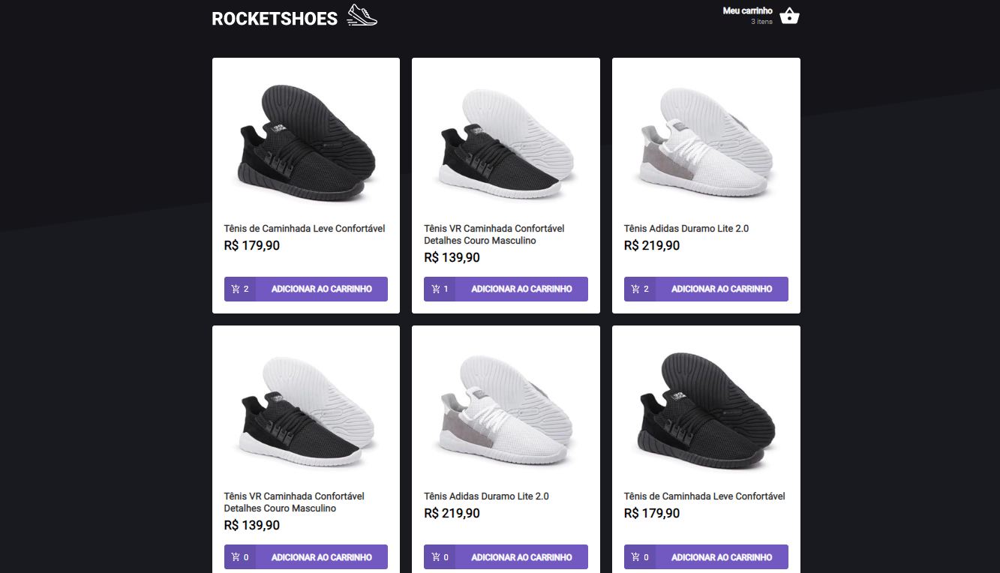
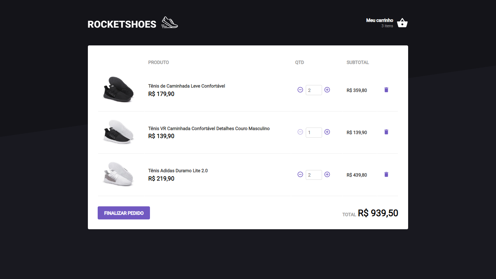

<h2 align=center>:rocket: Criando um hook em carrinho de compras</h2>

## :computer: Sobre o projeto

Projeto para realizar a implementação de hooks em uma pagina de compras.

## :star: Layout do projeto

- Tela inicial

- Aba do carrinho

## :rocket: Desafios propostos:</h3>

- Adicionar um novo produto ao carrinho;
- Remover um produto do carrinho;
- Alterar a quantidade de um produto no carrinho;
- Cálculo dos preços sub-total e total do carrinho;
- Validação de estoque;
- Exibição de mensagens de erro;
- Entre outros.

### Visite meu linkedin:
  &nbsp;&nbsp;
